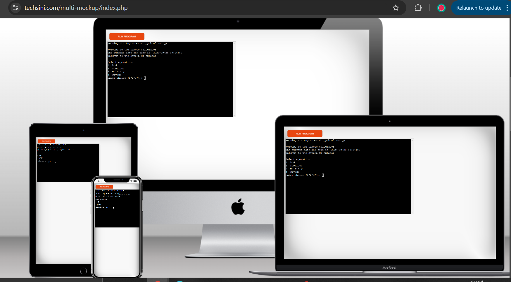
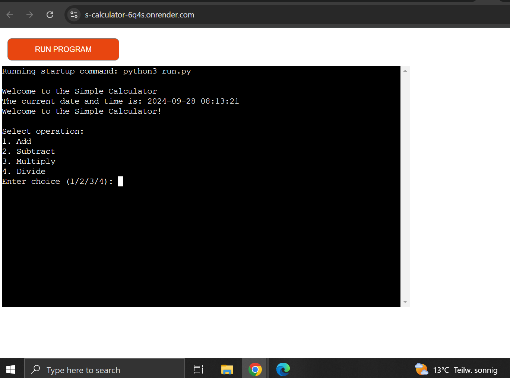
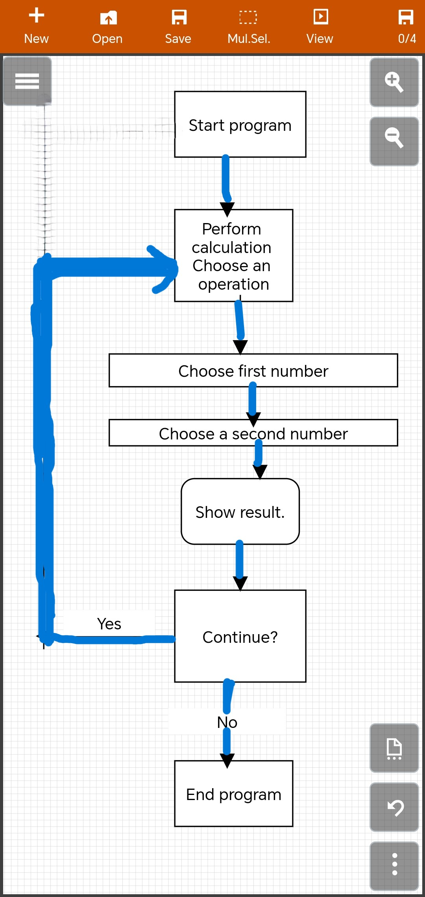
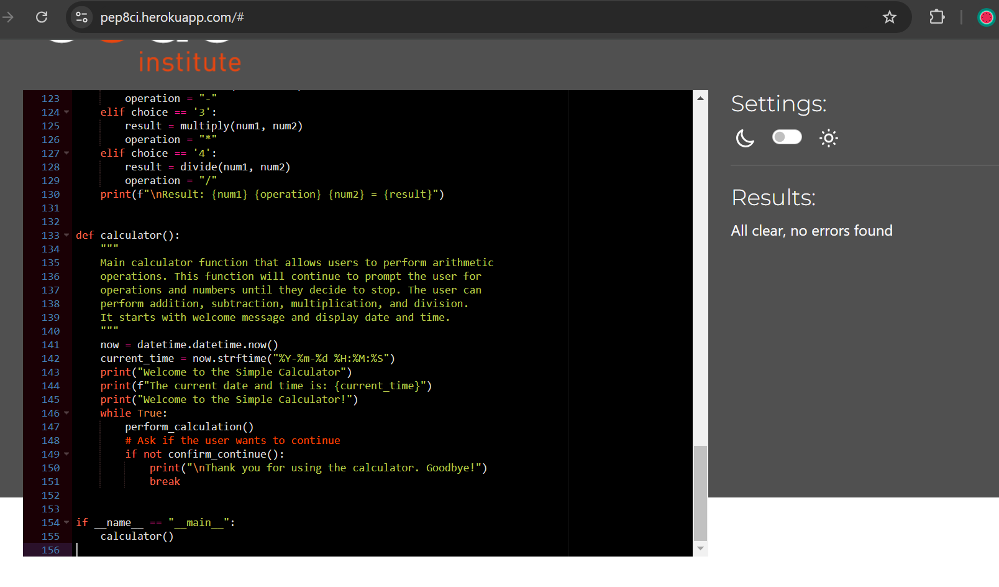
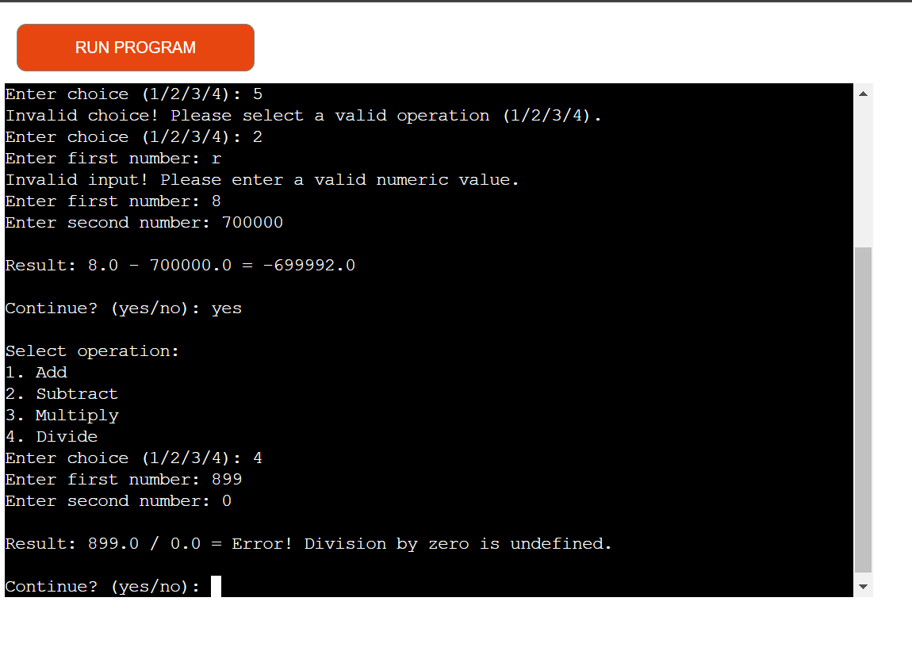
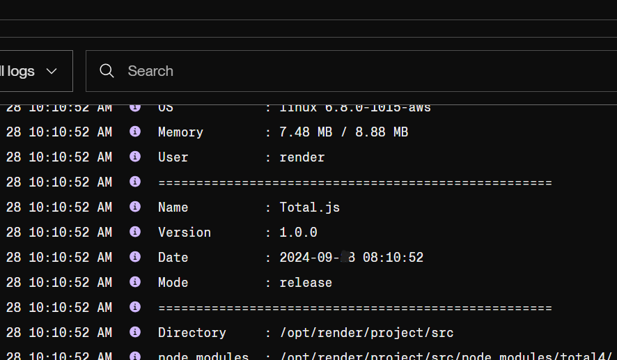
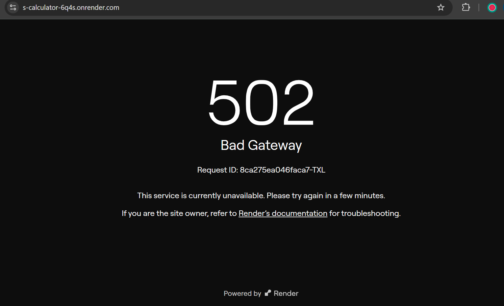
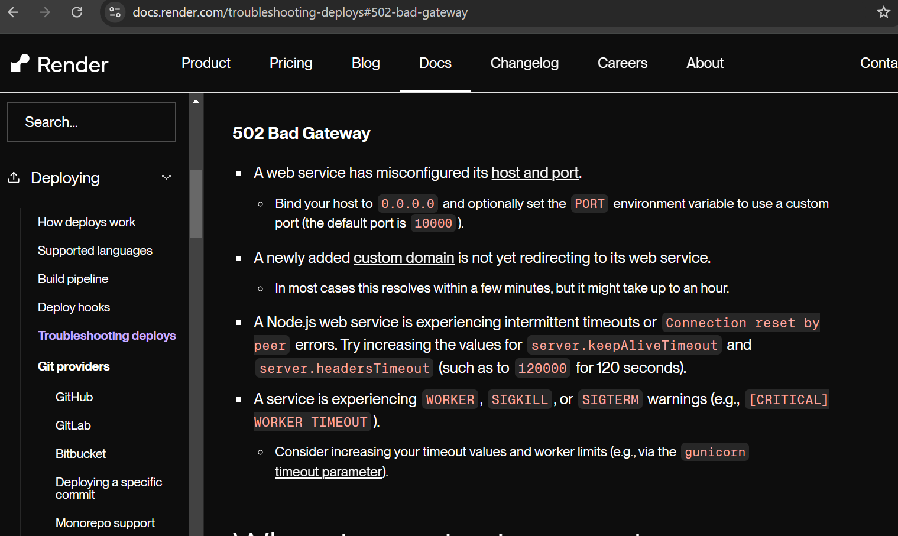
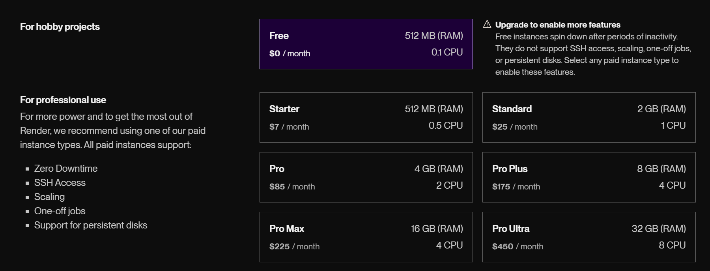

# Welcome to the Simple Calculator Website! 
This website allows users to perform basic arithmetic operations such as addition, subtraction, multiplication, and division. And it displays current date and time.

View the live site here - <a href="https://s-calculator-6q4s.onrender.com" target="_blank"> Simple Calculator </a>

# User Experience
The website Simple Calculator offers a straightforward and user-friendly experience. Here are some key aspects of the user experience:

Simplicity and Design: The interface is clean and minimalistic, making it easy for users to navigate and perform calculations without any distractions. The design focuses on functionality, ensuring that users can quickly access the calculator and start using it immediately.
Functionality: The calculator provides basic mathematical functions such as addition, subtraction, multiplication, and division. It performs these operations efficiently and displays results instantly, which is crucial for a smooth user experience.
Accessibility: The website is accessible on various devices, including desktops, tablets, and smartphones. This ensures that users can perform calculations on the go, enhancing the overall convenience.
Performance: The calculator operates smoothly without any noticeable lag or delays. This reliability is important for maintaining user trust and satisfaction.
User Feedback: The website could benefit from incorporating user feedback mechanisms, such as a rating system or a feedback form, to continuously improve the user experience based on real user input.
Overall, the Simple Calculator website excels in providing a no-frills, efficient tool for basic calculations, making it a valuable resource for users seeking quick and reliable mathematical operations.

# User Stories
User Story 1: Basic Calculation
As a student, I want to quickly perform basic arithmetic calculations so that I can check my homework answers efficiently.

User Story 2: Mobile Accessibility
As a professional on the go, I want to access the calculator on my smartphone so that I can perform quick calculations during meetings or while traveling.

User Story 3: User-Friendly Interface
As a senior citizen, I want to use a calculator with a simple and clear interface so that I can easily perform calculations without confusion.

User Story 4: Reliable Performance
As a small business owner, I want to use a reliable and fast calculator so that I can quickly calculate totals and percentages for my daily transactions.

User Story 5: Educational Tool
As a teacher, I want to recommend a simple online calculator to my students so that they can practice their math skills without getting distracted by complex features.

These user stories help in understanding the diverse needs of different users and ensuring the website meets those needs effectively.

# Features
Addition: Add two numbers. 
Subtraction: Subtract one number from another. 
Multiplication: Multiply two numbers. 
Division: Divide one number by another, with error handling for division by zero. 
Displaying current Time and date.

# Technologies used

python 
github 

# Flowchart of logic:
1. Start: The program begins.
Welcome Message: Display a welcome message to the user.
2. Perform Calculation:
Get Operation Choice: Prompt the user to select an operation (Add, Subtract, Multiply, Divide).
3. Get Numbers: Prompt the user to enter two numbers.
4. Perform Operation: Based on the selected operation, perform the corresponding arithmetic operation.
5. Display Result: Show the result of the operation.
6. Continue?: Ask the user if they want to perform another calculation.
A. If Yes, repeat the process from Perform Calculation.
B. If No, display a thank you message and end the program.

# Testing Python code:
a test was run on [CI linter](https://pep8ci.herokuapp.com/#) and no errors were found. All clear.

# Manual Testing:
I tried to enter nothing for a number   - doesnt accept - pass test 
I tried to enter a letter or a word  - does not accept - pass test 
I tried to divide by zero - doesnt accept - pass test 
I tried to enter somthing other than yes or no for the question continue? - does not accept - pass test 
I tried to enter a number other than (1,2,3,4) for the question of chosing an operation - does not accept - pass test 

# Deployment

The deployment was done on [render.com](render.com) and [github](githup.com)

1. go to your account on render.com and press get started for free it will take you to the second page where you can see a New button in the navbar up , press it to have a dropdwn menue where you can choose web services.
2. you can see here a box that shows github button press it and add your github project URL then down the box will be another button with the word connect. press it to connect your github to render. The connect button will not be activated till you choose a project from within the box.
3. when you press connect you will be in the setting page. important is the following to be added:
    a. Build command: pip install -r requirements.txt && npm install
    b. Start command: node index.js
    c. environment variables: PORT; 8000
   
5. finished setting then press deploy web service butoon down in the page it will take you to the last page where you see your deployed link.

   I used the CI template on github after I deleted procfile and runtime.text.

The deployment was successful based on the free service from [render.com](render.com) . 

However the free tier does not guarantee that the link will be active all the time, and sometimes throws 502 port error. A problem I have documented with my mentor and cohort facilitator. This is nothing to do with a bad code or wrong setting.  

As far as I understood, this is because of the free tier but the solution is just to hit the link after a while and it will work Fine. I was forced to use the free service from [render.com](render.com) because I dont have a credit card. The thing that has already excluded the use of Heroku service as well. 

Here is the explanation from Render Service to the port issue. I have already set my custom port to 8000 in the enviromental Var. I got this setting from a tutor in code institute during a tutoring session, where I got helped till the website was sucsessfully deployed.

## Forking the GitHub Repository

By forking the GitHub Repository we make a copy of the original repository on our GitHub account to view and/or make changes without affecting the original repository by using the following steps...

1. Log in to GitHub and locate the GitHub Repository
2. At the top of the Repository (not top of page) just above the "Settings" Button on the menu, locate the "Fork" Button.
3. You should now have a copy of the original repository in your GitHub account.

# Python Libraries:

[Datetime](https://docs.python.org/3/library/datetime.html#datetime.datetime.now) was used to show the time and date of starting the app as they appear with the welcome message at the beginning.

## Credits: 

. This project was inspired from code institute project [Love Math](https://learn.codeinstitute.net/courses/course-v1:CodeInstitute+LM101+3/courseware/2d651bf3f23e48aeb9b9218871912b2e/234519d86b76411aa181e76a55dabe70/) where the functions of a calculator were presented and explained but which in Javascript. I took it from there to create my python project. 
. Mockup was generated from [techsini.com](https://techsini.com/multi-mockup/index.php)  
. Flowchart of logic was created with[Flodia Diagrams](https://www.bezapps.com/)  
.[CI Python lintor](https://pep8ci.herokuapp.com/#) was used to do the python code testing.

## Aknowledgement:

I am grateful to the support I got from my mentor, Spencer Barriball. His advices and tips were invaluable. To whom I am deeply grateful. I would like to thank the  tutors,cohort facilitator and evryone else who has answered me on Slack. Thank you.

